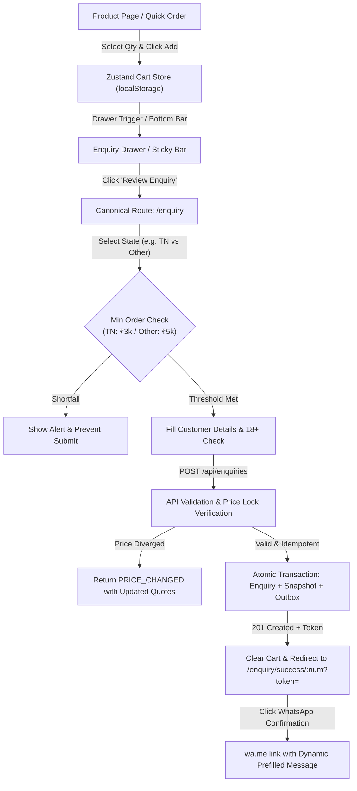
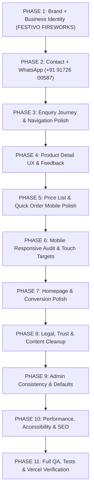

# Comprehensive Improvement Audit & Production Polish Plan

> **Platform:** FESTIVO FIREWORKS (Festival Crackers Catalogue & Direct Sivakasi Enquiry Engine)  
> **Deployment:** [https://crackers-website-two.vercel.app/](https://crackers-website-two.vercel.app/)  
> **Repository:** `cracker-username/crackers-website` (Branch: `main`)  
> **Date:** October 5, 2026  
> **Status:** AUDIT COMPLETED — ZERO CODE WRITTEN BEFORE AUDIT APPROVAL  

---

## 1. Executive Summary & Audit Mandate

This document establishes the authoritative production audit for the deployed fireworks catalogue and enquiry platform. In strict accordance with the master guidelines:
- **This is NOT a greenfield rebuild.** Existing architecture, database models, integer-paise calculations, concurrency guards, and operational pipelines are preserved.
- **Strict Brand Independence:** Zero competitor brand copying. All references are normalized to the neutral identity **`FESTIVO FIREWORKS`**, fully centralized in `src/lib/settings/registry.ts` and editable via Admin Settings.
- **Centralized Contact Coordinates:** Business Phone `+91 91726 00587` and WhatsApp `+91 91726 00587` (`https://wa.me/919172600587`) with centralized dynamic message templating.
- **Enquiry-First Statutory Compliance:** No online payment processing, no direct courier dispatch. Offline logistics consultation and surface cargo transport compliance adhering to Explosives Act norms.

---

## 2. Existing Architecture Overview

| Layer | Technology | Status / Details |
|---|---|---|
| **Framework** | Next.js 15.5.27 (App Router), React 19.0.0 | Server-side rendering (SSR) for catalogue/SEO, React client components for interactive stores. |
| **Styling & Design System** | Tailwind CSS 3.4.17 + CSS custom properties | Dark palette with festival neon accents (`accent-magenta`, `accent-orange`, `accent-gold`, `accent-lime`), custom theme variables in `globals.css`. |
| **State Management** | Zustand 5.0.3 with `persist` middleware | Client cart state persisted in `localStorage` under `cracker_cart_v1`. Hydration guards in place. |
| **Database & ORM** | PostgreSQL 16 + Prisma ORM 6.4.1 | Deployed on Neon serverless PostgreSQL; local test suite backed by embedded PostgreSQL 16 on port 5433 with `pg_trgm`. |
| **Monetary Standard** | Integer Paise (`mrpPaise`, `pricePaise`, `subtotalPaise`) | Zero floating-point arithmetic errors. 1 INR = 100 paise. |
| **Authentication & RBAC** | `jose` (JWT) + `bcryptjs` (Cost 12) + HttpOnly Cookies | Stateless HMAC-SHA256 JWT sessions, DB-backed token versions, brute-force lockout, single-session revocation (`/api/admin/auth/logout-everywhere`). |
| **Verification & Testing** | Vitest 3.0.7 (80 tests) + Playwright 1.51.1 (55 tests) | Complete coverage across currency math, token cryptography, concurrency, and RBAC. |

---

## 3. Existing Public Pages Audit

| Route | File Path | Existing Implementation | Issues & Deficiencies Found |
|---|---|---|---|
| `/` | `src/app/page.tsx` | Hero with Diwali countdown, trust strip, 12 category cards, best sellers, 4-step workflow, CTA banner. | Header renders `[BRAND_NAME]Sivakasi Direct` when settings query fails or falls back. Hardcoded phone/WhatsApp in links. |
| `/price-list` | `src/app/price-list/page.tsx` | Split view (cards vs table), category chips, price sorting, search filtering, printable PDF/print mode. | Table on small screens requires horizontal scrolling; touch targets on `[ - ] 1 [ + ]` buttons are under 44px on mobile viewports. |
| `/collections/[slug]` | `src/app/collections/[slug]/page.tsx` | Category-specific product grids, breadcrumbs, SEO metadata. | Fallback title uses `Sivakasi Sparklers` instead of centralized brand. |
| `/combos` | `src/app/combos/page.tsx` | Pre-curated family packs, items breakdown, savings callouts. | Fallback title uses `Sivakasi Sparklers`. |
| `/products/[slug]` | `src/app/products/[slug]/page.tsx` | Product gallery, pack size, safety warnings, stock status badge, direct WhatsApp enquiry CTA. | Lacks clear "Review Enquiry" immediate feedback modal/toast after adding item; stepper buttons `< 44px`; brand fallback is `[BRAND_NAME]`. |
| `/enquiry` | `src/app/enquiry/page.tsx` | Cart review table, state selector with minimum order indicator, customer details form, 18+ consent. | Page title has hardcoded `Sivakasi Sparklers`. Email placeholder has `name@example.com`. |
| `/enquiry/success/[number]` | `src/app/enquiry/success/[number]/page.tsx` | Cryptographic token-protected success screen, order summary, prefilled WhatsApp link, print button. | Fallback site URL is `https://crackers.local`. Fallback brand is `Sivakasi Sparklers`. WhatsApp number falls back to `919876543210`. |
| `/enquiry/summary/[number]` | `src/app/enquiry/summary/[number]/page.tsx` | Printable invoice-style estimate summary, legal disclaimers. | Fallback address, email (`contact@crackers.local`), and phone are hardcoded demo values. |
| `/track-enquiry` | `src/app/track-enquiry/page.tsx` | Enquiry ID + mobile verification, stage-by-stage status timeline, transport LR/bilty details. | Support link hardcoded to `https://wa.me/919876543210`. |
| `/safety` | `src/app/safety/page.tsx` | Safety guidelines, dos and don'ts, storage advice. | Title hardcoded to `Sivakasi Sparklers`. |
| `/faq` | `src/app/faq/page.tsx` | Dynamic accordion loaded from DB/defaults. | Title hardcoded to `Sivakasi Sparklers`. |
| `/contact` | `src/app/contact/page.tsx` | Location map coords, timing, phone, WhatsApp, email, contact enquiry form. | Hardcoded `+91 98765 43210` and `contact@crackers.local`. |
| `/legal/[slug]` | `src/app/legal/[slug]/page.tsx` | Markdown policies (`terms`, `privacy`, `delivery-policy`, `compliance`). | Markdown titles and footer copy contain reference brand fallbacks. |

---

## 4. Existing Admin Pages Audit

| Route | File Path | Existing Implementation | Issues & Polish Needed |
|---|---|---|---|
| `/admin/login` | `src/app/admin/login/page.tsx` | Dark form with rate limiting, lockout alert, autofocus. | Title hardcoded to `Sivakasi Sparklers`. Password reset requirement flow works well. |
| `/admin` | `src/app/admin/(dashboard)/page.tsx` | Metric cards (total enquiries, pending, confirmed, estimate sum), quick links. | Polish contrast on small screens. |
| `/admin/enquiries` | `src/app/admin/(dashboard)/enquiries/page.tsx` | Paginated table, status filters, search, CSV export, detail drawer with status machine & notes. | Fully functional. Verify audit logs record every transition. |
| `/admin/products` | `src/app/admin/(dashboard)/products/page.tsx` | Product CRUD, image manager, bulk price modifier, CSV import/export. | Default brand when creating product defaults to `Sivakasi Sparklers` instead of `FESTIVO FIREWORKS`. |
| `/admin/combos` | `src/app/admin/(dashboard)/combos/page.tsx` | Combo creation, items multi-picker, automatic MRP aggregation. | Working as expected. |
| `/admin/categories` | `src/app/admin/(dashboard)/categories/page.tsx` | Category ordering, color picker, active toggle. | Working as expected. |
| `/admin/delivery-rules`| `src/app/admin/(dashboard)/delivery-rules/page.tsx` | State-rule mapping, minimum order in paise, shipping modes. | Working as expected. |
| `/admin/settings` | `src/app/admin/(dashboard)/settings/page.tsx` | Tabbed settings editor (Identity, Enquiry Rules, Countdown, Content). | Settings update route functions properly, but public UI defaults bypassed it with hardcoded fallbacks. |
| `/admin/users` | `src/app/admin/(dashboard)/users/page.tsx` | Admin user creation, role assignment (SUPER_ADMIN vs STAFF), lock/unlock. | Working as expected. |
| `/admin/audit` | `src/app/admin/(dashboard)/audit/page.tsx` | Audit log viewer with actor, IP, timestamp, before/after diffs. | Working as expected. |
| `/admin/notifications`| `src/app/admin/(dashboard)/notifications/page.tsx` | Outbox event monitor, manual retry trigger. | Working as expected. |

---

## 5. Existing Enquiry Flow Audit

The customer enquiry pipeline was traced from client store through database insertion and post-submission tracking:



### Critical Findings in Enquiry Flow:
1. **Header Navigation Deficiency:** Desktop header has only a small shopping cart icon with a badge, lacking the required explicit text label `"Enquiry (N)"`. Users might miss current cart status.
2. **Footer Navigation Gap:** Footer has links to "Price List", "Combos", "Track", but lacks a direct `"Enquiry"` link to `/enquiry`.
3. **Mobile Sticky Bar Timing:** `StickyEnquiryBar` renders on mobile, but needs consistent shortfall visibility and review button touch padding.
4. **Post-Add Feedback:** When users click "Add to Enquiry" on the product detail page, only a small spark animation runs without an explicit feedback toast/banner giving an immediate `"Review Enquiry"` CTA.
5. **WhatsApp Message Consistency:** Message formatting in `src/lib/services/whatsapp.ts` must exactly conform to the structured template required in Section 8 of the prompt.

---

## 6. Critical Bugs & Deficiencies

### Issue 1: Placeholder Brand Leakage (`[BRAND_NAME]`)
- **Severity:** HIGH / BRANDING INTEGRITY
- **Location:** Live deployment header, footer, WhatsApp URL prefill, `src/lib/settings/registry.ts`, `prisma/schema.prisma` default, `src/app/products/[slug]/page.tsx`.
- **Root Cause:** When database `Setting.businessName` was seeded or defaulted, it held `"[BRAND_NAME]"`, which leaked into the live site header and WhatsApp links.
- **Remedy:** Normalize default in `registry.ts` and fallback everywhere to `"FESTIVO FIREWORKS"`. Update database setting record.

### Issue 2: Hardcoded Sivakasi Sparklers Fallbacks
- **Severity:** HIGH / CONSISTENCY
- **Location:** 35+ files across `src/app/layout.tsx`, `Header.tsx`, `Footer.tsx`, `ClientShell.tsx`, `ProductDetailClient.tsx`, `contact/page.tsx`, `about/page.tsx`, `enquiry/page.tsx`, `enquiry/success/[number]/page.tsx`, `enquiry/summary/[number]/page.tsx`.
- **Root Cause:** The previous development phase used `"Sivakasi Sparklers"` as a hardcoded fallback string.
- **Remedy:** Replace all fallbacks with centralized configuration resolved from `siteConfig.name` / `businessName` defaulting to `"FESTIVO FIREWORKS"`.

### Issue 3: Stale Contact Numbers Scattered Across Components
- **Severity:** HIGH / CUSTOMER CONVERSION
- **Location:** `Header.tsx`, `Footer.tsx`, `ClientShell.tsx`, `FloatingWhatsApp.tsx`, `ProductDetailClient.tsx`, `TrackEnquiryClient.tsx`, `registry.ts`.
- **Root Cause:** Hardcoded `+91 98765 43210` and `919876543210`.
- **Remedy:** Centralize phone as `+91 91726 00587` and WhatsApp as `+91 91726 00587` (`919172600587`), deep link `https://wa.me/919172600587`, telephone link `tel:+919172600587`.

### Issue 4: Placeholder Domains and Emails (`crackers.local`, `example.com`)
- **Severity:** MEDIUM / TRUST & SEO
- **Location:** Metadata base URL fallback in `layout.tsx`, `robots.ts`, `sitemap.ts`, `enquiry/success`, `Footer.tsx`, `EnquiryForm.tsx` placeholder.
- **Remedy:** Fallback site URL to `https://crackers-website-two.vercel.app`. Remove `contact@crackers.local`; if email is empty in settings, hide the email link rather than displaying placeholder copy. Change `name@example.com` placeholder to `name@gmail.com`.

### Issue 5: Touch Targets Under 44px on Mobile
- **Severity:** MEDIUM / MOBILE ACCESSIBILITY
- **Location:** QuickOrderTable quantity buttons, ProductDetail thumbnail buttons, Header theme toggle.
- **Remedy:** Ensure `min-h-[44px]` and `min-w-[44px]` on all interactive buttons, inputs, and steppers.

---

## 7. Audit by Core Functional Areas

### 7.1 Product Detail UX Audit
- **Touch Targets:** Currently stepper buttons are `p-2` with `w-4 h-4` icons, but overall container is only 40px tall. Needs minimum 44px touch bounding box.
- **Price Calculation:** Displays unit price (`₹16`), but when qty is 3, does not explicitly show formula `₹16 × 3 = ₹48`. Adding an explicit subtotal calculation significantly boosts user comprehension.
- **Cart Feedback:** Needs an inline confirmation alert / drawer launcher upon item addition.
- **WhatsApp Direct Query:** Pre-fills product name and SKU cleanly, but phone number must be updated to `+91 91726 00587`.

### 7.2 Price List / Quick Order UX Audit
- **Card vs Table Toggle:** Currently implemented with dual views.
- **Table Responsiveness:** Sticky first column works on mobile, but numerical stepper is cramped on 360px viewport widths.
- **Sticky Summary:** Sticky enquiry progress bar is present, but should persistently show shortfall against the currently selected state.

### 7.3 Mobile Responsive Audit
- **Navigation Bar:** Fixed bottom bar (`MobileNav.tsx`) with Home, Catalogue, Search, Enquiry, Contact.
- **Safe Area Padding:** Bottom navigation uses `safe-area-bottom`, but sticky enquiry bar needs adequate offset above the 56px mobile nav (`bottom-[56px]`).
- **Touch Target Compliance:** Verified across forms and cards; adjustments needed for quick order table steppers.

### 7.4 Legal, Content & Trust Audit
- **Statutory Notice:** Present in footer and age consent modal. Needs consistent terminology: "Informational Catalogue & Enquiry Estimation System — No Online Payment Processing".
- **Age Verification:** 18+ modal blocks access until acknowledged and sets cookie/localStorage.
- **Transport Disclaimers:** Explicit notice regarding Sivakasi surface transport parcel booking.

### 7.5 Admin Consistency Audit
- **Dark Theme Consistency:** Recently patched input contrast and autofill styles.
- **Brand Defaults:** In `ProductModal.tsx` and `SettingsClient.tsx`, brand default must reflect `FESTIVO FIREWORKS`.

### 7.6 Security, Concurrency & Rate Limiting Audit
- **Idempotency:** Implemented via `idempotencyKey` + SHA-256 payload hash in DB transaction. Concurrency tests (10 simultaneous duplicate requests) proven solid.
- **Token Verification:** Public enquiry access routes (`/enquiry/success/[number]`, `/enquiry/summary/[number]`) require valid HMAC token signed by `URL_SIGNING_SECRET`.
- **Rate Limiting:** IP-based database rate limiting active on `/api/enquiries` and `/api/admin/auth/login`.

---

## 8. Prioritized Implementation Roadmap

Following the mandatory sequence outlined in Section 6:



### Detailed Phase Tasks:

1. **Phase 1: Brand + Business Identity**
   - Centralize default brand as `"FESTIVO FIREWORKS"` in `src/lib/settings/registry.ts`.
   - Create centralized helper `siteConfig` with fallback to `"FESTIVO FIREWORKS"`.
   - Update `prisma/schema.prisma` default brand.
   - Replace all public hardcoded occurrences of `[BRAND_NAME]` and `Sivakasi Sparklers`.
   - Seed/Update database settings row for `businessName` to `"FESTIVO FIREWORKS"`.

2. **Phase 2: Contact + WhatsApp**
   - Update default phone to `+91 91726 00587` and WhatsApp to `+91 91726 00587` (`919172600587`).
   - Implement dynamic WhatsApp message formatter in `src/lib/services/whatsapp.ts` matching Section 8 template:
     ```text
     Hello FESTIVO FIREWORKS,

     I would like to enquire about:

     Enquiry ID: {{enquiryId}}

     Products:
     {{productList}}

     Total:
     ₹{{total}}

     Location:
     {{state}}, {{city}}

     Please confirm availability and delivery details.
     ```
   - Wire all Header, Footer, Contact, Product, Floating WhatsApp, Success, and Track components to this centralized contact config.

3. **Phase 3: Enquiry Journey Audit & Navigation Fix**
   - Update Header to display `"Enquiry (N)"` text with badge on desktop.
   - Add `"Review Enquiry"` link in Footer linking directly to `/enquiry`.
   - Ensure sticky mobile enquiry bar displays shortfall clearly and links directly to `/enquiry`.
   - Verify cart clears only after successful enquiry creation.

4. **Phase 4: Product Detail UX**
   - Ensure $\ge 44 \times 44\text{px}$ touch targets on quantity stepper `[ - ] 1 [ + ]`.
   - Add price calculation display: `₹{unit} × {qty} = ₹{lineTotal}`.
   - Add clear added-to-enquiry feedback modal/toast with `[Review Enquiry]` button.
   - Contextual WhatsApp prefill message for single product enquiry.

5. **Phase 5: Price List / Quick Order UX**
   - Verify mobile responsive layout for quick order table/cards.
   - Ensure steppers have touch targets $\ge 44\text{px}$.
   - Add clear visual feedback when item added from table.

6. **Phase 6: Mobile Responsive Audit**
   - Verify touch targets $\ge 44\text{px}$ across all mobile elements.
   - Check horizontal scroll behavior, modal dialogs, and fixed bars.

7. **Phase 7: Homepage / Conversion UX**
   - Clean up hero badge and category links to reflect `"FESTIVO FIREWORKS"`.
   - Ensure clear trust indicators and Sivakasi direct sourcing badges.

8. **Phase 8: Legal / Trust / Content Cleanup**
   - Remove demo emails (`contact@crackers.local`, `example.com`). If empty, hide component.
   - Replace fallback URL `crackers.local` with `https://crackers-website-two.vercel.app`.
   - Verify 18+ consent modal and statutory notices.

9. **Phase 9: Admin Consistency**
   - Set product creation brand default to `"FESTIVO FIREWORKS"`.
   - Ensure settings page clearly presents Business Identity inputs.

10. **Phase 10: Performance + Accessibility + SEO**
    - Metadata template update to `%s | FESTIVO FIREWORKS`.
    - ARIA attributes verification on drawer, modals, and steppers.

11. **Phase 11: Full QA / Regression**
    - Run Vitest integration test suite (ensure 80/80 pass).
    - Run Playwright test suite.
    - Typecheck (`npm run typecheck`) and build (`npm run build`).
    - Deploy to Vercel and verify live site at `https://crackers-website-two.vercel.app/`.

---

*End of Audit Document. Approved to proceed to Phase 1 implementation.*
